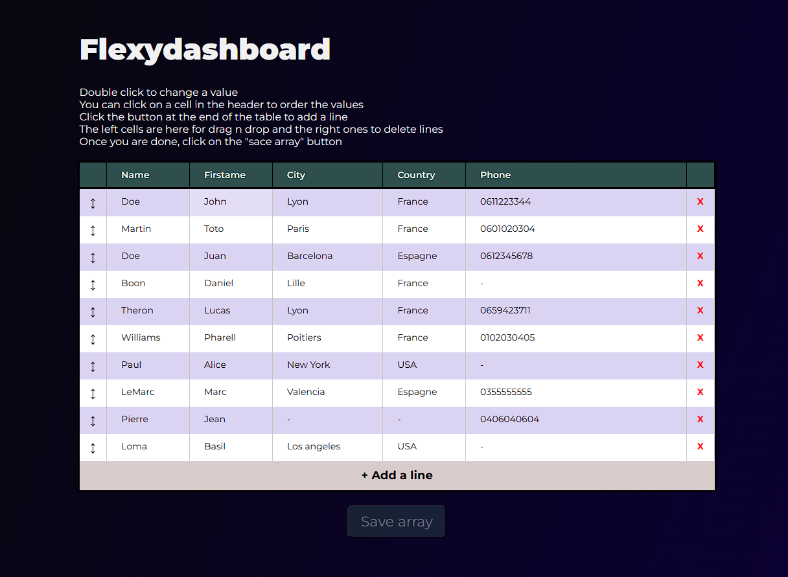
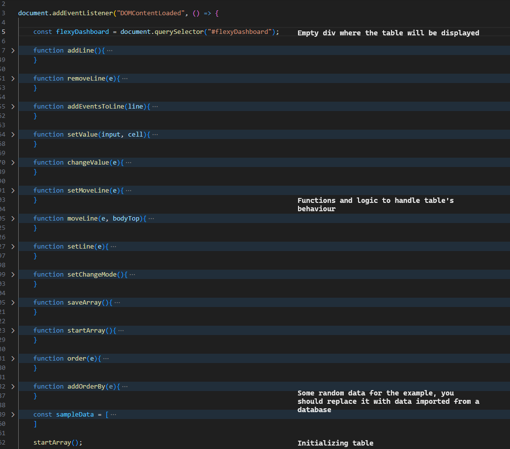

# flexyDashboard
Some ready to use native js code to display and interact with a table

# Ready to use
The goal of this project is to prepare easy and reusable sample code for your tables
Dashboards are very common in web developpement, that's why the code is basic: it has to be easy to implement and edit

# Demo
<video src='flexydashboard-video.mp4' width=180/>
<a href="https://codepen.io/LTSERVICES/pen/JjzYjQj">Try it in codepen !</a>
